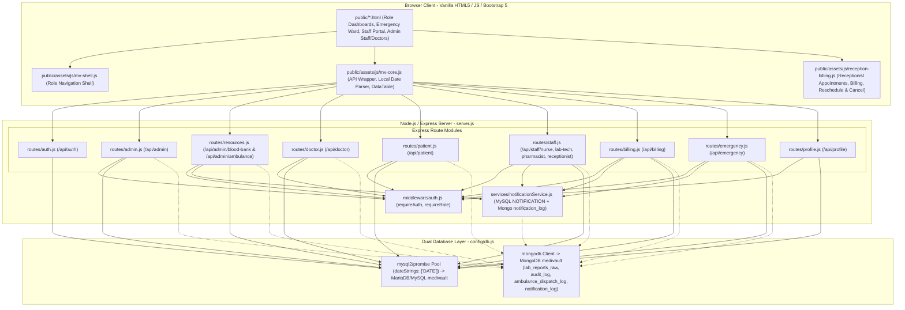

# Component Diagram
## MediVault / MediCare Application Architecture

```mermaid
graph TD
    subgraph Frontend [Browser Client - Vanilla HTML5 / JS / Bootstrap 5]
        Shell["public/assets/js/mv-shell.js (Role Navigation Shell)"]
        Core["public/assets/js/mv-core.js (API Wrapper, Local Date Parser, DataTable)"]
        ReceptJS["public/assets/js/reception-billing.js (Receptionist Appointments, Billing, Reschedule & Cancel)"]
        Pages["public/*.html (Role Dashboards, Emergency Ward, Staff Portal, Admin Staff/Doctors)"]
    end

    subgraph Backend [Node.js / Express Server - server.js]
        AuthMW["middleware/auth.js (requireAuth, requireRole)"]
        NotifSvc["services/notificationService.js (MySQL NOTIFICATION + Mongo notification_log)"]

        subgraph Routers [Express Route Modules]
            R_Auth["routes/auth.js (/api/auth)"]
            R_Admin["routes/admin.js (/api/admin)"]
            R_Res["routes/resources.js (/api/admin/blood-bank & /api/admin/ambulance)"]
            R_Doc["routes/doctor.js (/api/doctor)"]
            R_Pat["routes/patient.js (/api/patient)"]
            R_Staff["routes/staff.js (/api/staff/nurse, lab-tech, pharmacist, receptionist)"]
            R_Bill["routes/billing.js (/api/billing)"]
            R_Emg["routes/emergency.js (/api/emergency)"]
            R_Prof["routes/profile.js (/api/profile)"]
        end
    end

    subgraph DataLayer [Dual Database Layer - config/db.js]
        MySQLPool["mysql2/promise Pool (dateStrings: ['DATE']) -> MariaDB/MySQL medivault"]
        MongoConn["mongodb Client -> MongoDB medivault (lab_reports_raw, audit_log, ambulance_dispatch_log, notification_log)"]
    end

    Pages --> Shell
    Pages --> Core
    Pages --> ReceptJS
    Core --> R_Auth
    Core --> R_Admin
    Core --> R_Res
    Core --> R_Doc
    Core --> R_Pat
    Core --> R_Staff
    Core --> R_Bill
    Core --> R_Emg
    Core --> R_Prof

    R_Admin --> AuthMW
    R_Res --> AuthMW
    R_Doc --> AuthMW
    R_Pat --> AuthMW
    R_Staff --> AuthMW
    R_Bill --> AuthMW
    R_Emg --> AuthMW
    R_Prof --> AuthMW

    R_Res --> NotifSvc
    R_Staff --> NotifSvc
    R_Bill --> NotifSvc
    R_Emg --> NotifSvc

    R_Auth --> MySQLPool
    R_Admin --> MySQLPool
    R_Res --> MySQLPool
    R_Doc --> MySQLPool
    R_Pat --> MySQLPool
    R_Staff --> MySQLPool
    R_Bill --> MySQLPool
    R_Emg --> MySQLPool
    R_Prof --> MySQLPool

    R_Admin -.-> MongoConn
    R_Res -.-> MongoConn
    R_Doc -.-> MongoConn
    R_Pat -.-> MongoConn
    R_Staff -.-> MongoConn
    R_Bill -.-> MongoConn
    R_Emg -.-> MongoConn
    NotifSvc -.-> MongoConn
```
