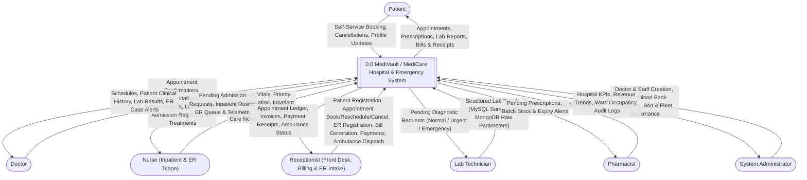

# Data Flow Diagram (DFD) – Level 0
## Context Level Diagram: MediVault / MediCare Hospital Management System

```mermaid
graph TD
    Patient(["Patient"])
    Doctor(["Doctor"])
    Nurse(["Nurse (Inpatient & ER Triage)"])
    Receptionist(["Receptionist (Front Desk, Billing & ER Intake)"])
    LabTech(["Lab Technician"])
    Pharmacist(["Pharmacist"])
    Admin(["System Administrator"])

    System[["0.0 MediVault / MediCare Hospital & Emergency System"]]

    Patient -->|"Self-Service Booking, Cancellations, Profile Updates"| System
    System -->|"Appointments, Prescriptions, Lab Reports, Bills & Receipts"| Patient

    Doctor -->|"Appointment Confirmations, Consultations, Prescriptions, Lab Orders, Admission Requests, ER Treatments"| System
    System -->|"Schedules, Patient Clinical History, Lab Results, ER Case Alerts"| Doctor

    Nurse -->|"ER Triage Vitals, Priority Engine Allocation, Inpatient Bed Assignment, Vitals, Care Notes, Bed Turnover"| System
    System -->|"Pending Admission Requests, Inpatient Roster, ER Queue & Telemetry"| Nurse

    Receptionist -->|"Patient Registration, Appointment Book/Reschedule/Cancel, ER Registration, Bill Generation, Payments, Ambulance Dispatch"| System
    System -->|"Appointment Ledger, Invoices, Payment Receipts, Ambulance Status"| Receptionist

    LabTech -->|"Structured Lab Results (MySQL Summary + MongoDB Raw Parameters)"| System
    System -->|"Pending Diagnostic Requests (Normal / Urgent / Emergency)"| LabTech

    Pharmacist -->|"FEFO Batch Dispensing"| System
    System -->|"Pending Prescriptions, Batch Stock & Expiry Alerts"| Pharmacist

    Admin -->|"Doctor & Staff Creation, Shifts, Blood Bank Approvals, Bed & Fleet Governance"| System
    System -->|"Hospital KPIs, Revenue Trends, Ward Occupancy, Audit Logs"| Admin
```
