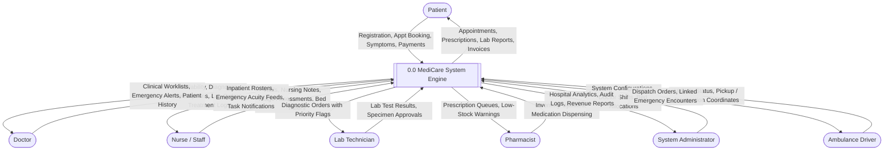

# Data Flow Diagram (DFD) – Level 0
## Context Level Diagram: MediCare Smart Hospital & Emergency Management System

```mermaid
graph TD
    Patient(["Patient"])
    Doctor(["Doctor"])
    Nurse(["Nurse / Staff"])
    LabTech(["Lab Technician"])
    Pharmacist(["Pharmacist"])
    Admin(["System Administrator"])
    AmbulanceDriver(["Ambulance Driver"])

    System[["0.0 MediCare System Engine"]]

    Patient -->|"Registration, Appt Booking, Symptoms, Payments"| System
    System -->|"Appointments, Prescriptions, Lab Reports, Invoices"| Patient

    Doctor -->|"Availability, Diagnoses, Prescriptions, Lab Orders, Treatment Logs"| System
    System -->|"Clinical Worklists, Emergency Alerts, Patient History"| Doctor

    Nurse -->|"Vitals, Nursing Notes, Triage Assessments, Bed Transfers"| System
    System -->|"Inpatient Rosters, Emergency Acuity Feeds, Task Notifications"| Nurse

    LabTech -->|"Lab Test Results, Specimen Approvals"| System
    System -->|"Diagnostic Orders with Priority Flags"| LabTech

    Pharmacist -->|"Inventory Updates, Medication Dispensing"| System
    System -->|"Prescription Queues, Low-Stock Warnings"| Pharmacist

    Admin -->|"System Configurations, Doctor Shifts, Bed Allocations"| System
    System -->|"Hospital Analytics, Audit Logs, Revenue Reports"| Admin

    AmbulanceDriver -->|"Vehicle Status, Pickup / Destination Coordinates"| System
    System -->|"Dispatch Orders, Linked Emergency Encounters"| AmbulanceDriver
```

