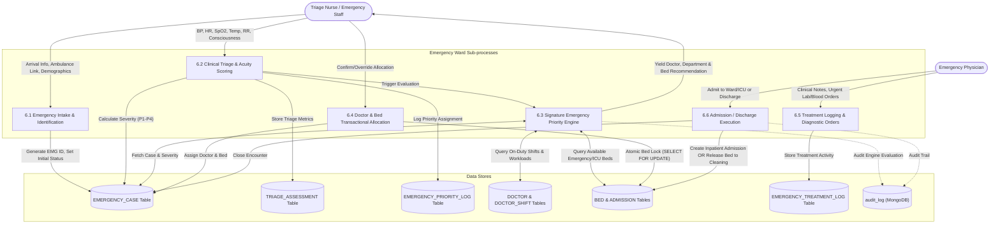

# Data Flow Diagram (DFD) – Level 2
## Subsystem 6.0: Emergency Ward & Signature Emergency Priority Engine

```mermaid
graph TD
    Staff(["Triage Nurse / Emergency Staff"])
    Doctor(["Emergency Physician"])

    subgraph EmergencyProcess [Emergency Ward Sub-processes]
        P6_1["6.1 Emergency Intake & Identification"]
        P6_2["6.2 Clinical Triage & Acuity Scoring"]
        P6_3["6.3 Signature Emergency Priority Engine"]
        P6_4["6.4 Doctor & Bed Transactional Allocation"]
        P6_5["6.5 Treatment Logging & Diagnostic Orders"]
        P6_6["6.6 Admission / Discharge Execution"]
    end

    subgraph EmergencyStores [Data Stores]
        D_EMG[("EMERGENCY_CASE Table")]
        D_TRIAGE[("TRIAGE_ASSESSMENT Table")]
        D_PLOG[("EMERGENCY_PRIORITY_LOG Table")]
        D_DOC[("DOCTOR & DOCTOR_SHIFT Tables")]
        D_BED[("BED & ADMISSION Tables")]
        D_TLOG[("EMERGENCY_TREATMENT_LOG Table")]
        D_AUDIT[("audit_log (MongoDB)")]
    end

    Staff -->|"Arrival Info, Ambulance Link, Demographics"| P6_1
    P6_1 -->|"Generate EMG ID, Set Initial Status"| D_EMG

    Staff -->|"BP, HR, SpO2, Temp, RR, Consciousness"| P6_2
    P6_2 -->|"Store Triage Metrics"| D_TRIAGE
    P6_2 -->|"Calculate Severity (P1-P4)"| D_EMG
    P6_2 -->|"Log Priority Assignment"| D_PLOG

    P6_2 -->|"Trigger Evaluation"| P6_3
    P6_3 <-->|"Fetch Case & Severity"| D_EMG
    P6_3 <-->|"Query On-Duty Shifts & Workloads"| D_DOC
    P6_3 <-->|"Query Available Emergency/ICU Beds"| D_BED
    P6_3 -->|"Yield Doctor, Department & Bed Recommendation"| Staff
    P6_3 -.->|"Audit Engine Evaluation"| D_AUDIT

    Staff -->|"Confirm/Override Allocation"| P6_4
    P6_4 -->|"Atomic Bed Lock (SELECT FOR UPDATE)"| D_BED
    P6_4 -->|"Assign Doctor & Bed"| D_EMG

    Doctor -->|"Clinical Notes, Urgent Lab/Blood Orders"| P6_5
    P6_5 -->|"Store Treatment Activity"| D_TLOG

    Doctor -->|"Admit to Ward/ICU or Discharge"| P6_6
    P6_6 -->|"Create Inpatient Admission OR Release Bed to Cleaning"| D_BED
    P6_6 -->|"Close Encounter"| D_EMG
    P6_6 -.->|"Audit Trail"| D_AUDIT
```

