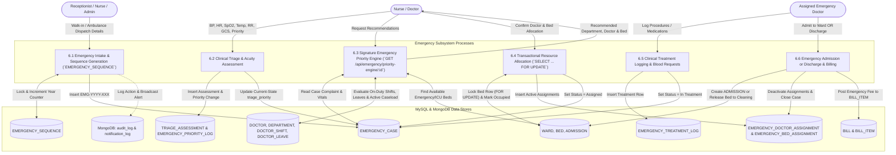

# Data Flow Diagram (DFD) – Level 2
## Subsystem 6.0: Emergency Ward, Triage & Signature Priority Engine

```mermaid
graph TD
    ReceptionOrNurse(["Receptionist / Nurse / Admin"])
    Nurse(["Nurse / Doctor"])
    Doctor(["Assigned Emergency Doctor"])

    subgraph EmergencyProcesses [Emergency Subsystem Processes]
        P6_1["6.1 Emergency Intake & Sequence Generation (`EMERGENCY_SEQUENCE`)"]
        P6_2["6.2 Clinical Triage & Acuity Assessment"]
        P6_3["6.3 Signature Emergency Priority Engine (`GET /api/emergency/priority-engine/:id`)"]
        P6_4["6.4 Transactional Resource Allocation (`SELECT ... FOR UPDATE`)"]
        P6_5["6.5 Clinical Treatment Logging & Blood Requests"]
        P6_6["6.6 Emergency Admission or Discharge & Billing"]
    end

    subgraph EmergencyStores [MySQL & MongoDB Data Stores]
        S_SEQ[("EMERGENCY_SEQUENCE")]
        S_CASE[("EMERGENCY_CASE")]
        S_TRIAGE[("TRIAGE_ASSESSMENT & EMERGENCY_PRIORITY_LOG")]
        S_SHIFT[("DOCTOR, DEPARTMENT, DOCTOR_SHIFT, DOCTOR_LEAVE")]
        S_ASSIGN[("EMERGENCY_DOCTOR_ASSIGNMENT & EMERGENCY_BED_ASSIGNMENT")]
        S_BED[("WARD, BED, ADMISSION")]
        S_TREAT[("EMERGENCY_TREATMENT_LOG")]
        S_BILL[("BILL & BILL_ITEM")]
        S_MONGO[("MongoDB: audit_log & notification_log")]
    end

    ReceptionOrNurse -->|"Walk-in / Ambulance Dispatch Details"| P6_1
    P6_1 <-->|"Lock & Increment Year Counter"| S_SEQ
    P6_1 -->|"Insert EMG-YYYY-XXX"| S_CASE
    P6_1 -.->|"Log Action & Broadcast Alert"| S_MONGO

    Nurse -->|"BP, HR, SpO2, Temp, RR, GCS, Priority"| P6_2
    P6_2 -->|"Insert Assessment & Priority Change"| S_TRIAGE
    P6_2 -->|"Update Current-State triage_priority"| S_CASE

    Nurse -->|"Request Recommendations"| P6_3
    P6_3 <-->|"Read Case Complaint & Vitals"| S_CASE
    P6_3 <-->|"Evaluate On-Duty Shifts, Leaves & Active Caseload"| S_SHIFT
    P6_3 <-->|"Find Available Emergency/ICU Beds"| S_BED
    P6_3 -->|"Recommended Department, Doctor & Bed"| Nurse

    Nurse -->|"Confirm Doctor & Bed Allocation"| P6_4
    P6_4 <-->|"Lock Bed Row (FOR UPDATE) & Mark Occupied"| S_BED
    P6_4 -->|"Insert Active Assignments"| S_ASSIGN
    P6_4 -->|"Set Status = Assigned"| S_CASE

    Doctor -->|"Log Procedures / Medications"| P6_5
    P6_5 -->|"Insert Treatment Row"| S_TREAT
    P6_5 -->|"Set Status = In Treatment"| S_CASE

    Doctor -->|"Admit to Ward OR Discharge"| P6_6
    P6_6 -->|"Create ADMISSION or Release Bed to Cleaning"| S_BED
    P6_6 -->|"Deactivate Assignments & Close Case"| S_ASSIGN
    P6_6 -->|"Post Emergency Fee to BILL_ITEM"| S_BILL
```
