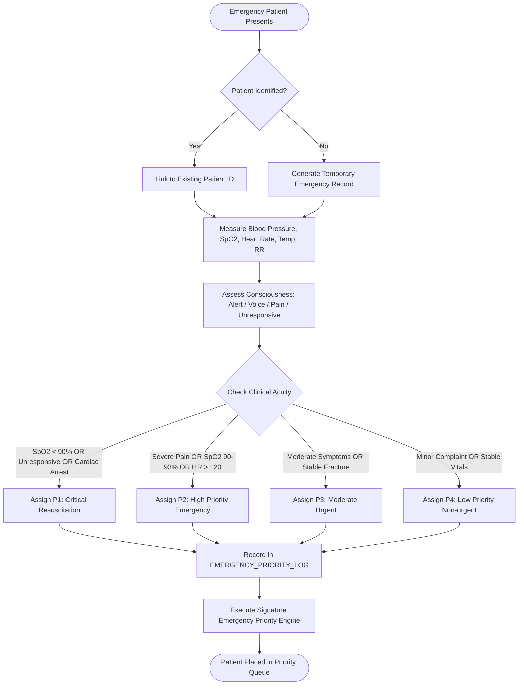
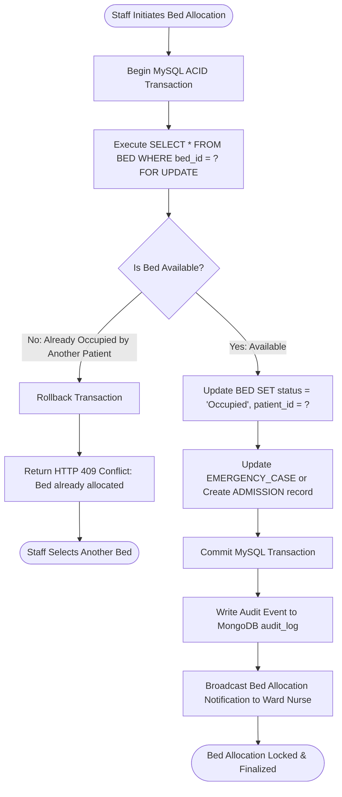

# Activity Diagrams
## Clinical & Operational Decision Workflows

### 1. Clinical Triage Assessment Activity

```mermaid
flowchart TD
    Start([Emergency Patient Presents]) --> CheckID{Patient Identified?}
    CheckID -- Yes --> AttachID[Link to Existing Patient ID]
    CheckID -- No --> TempID[Generate Temporary Emergency Record]

    AttachID --> MeasureVitals[Measure Blood Pressure, SpO2, Heart Rate, Temp, RR]
    TempID --> MeasureVitals

    MeasureVitals --> CheckConsciousness[Assess Consciousness: Alert / Voice / Pain / Unresponsive]
    CheckConsciousness --> EvaluateSeverity{Check Clinical Acuity}

    EvaluateSeverity -- SpO2 < 90% OR Unresponsive OR Cardiac Arrest --> AssignP1[Assign P1: Critical Resuscitation]
    EvaluateSeverity -- Severe Pain OR SpO2 90-93% OR HR > 120 --> AssignP2[Assign P2: High Priority Emergency]
    EvaluateSeverity -- Moderate Symptoms OR Stable Fracture --> AssignP3[Assign P3: Moderate Urgent]
    EvaluateSeverity -- Minor Complaint OR Stable Vitals --> AssignP4[Assign P4: Low Priority Non-urgent]

    AssignP1 --> LogPriority[Record in EMERGENCY_PRIORITY_LOG]
    AssignP2 --> LogPriority
    AssignP3 --> LogPriority
    AssignP4 --> LogPriority

    LogPriority --> TriggerEngine[Execute Signature Emergency Priority Engine]
    TriggerEngine --> End([Patient Placed in Priority Queue])
```

---

### 2. Concurrency-Safe Bed Allocation Activity

```mermaid
flowchart TD
    StartAlloc([Staff Initiates Bed Allocation]) --> BeginTx[Begin MySQL ACID Transaction]
    BeginTx --> LockRow[Execute SELECT * FROM BED WHERE bed_id = ? FOR UPDATE]
    LockRow --> CheckStatus{Is Bed Available?}

    CheckStatus -- No: Already Occupied by Another Patient --> RollbackTx[Rollback Transaction]
    RollbackTx --> ReturnConflict[Return HTTP 409 Conflict: Bed already allocated]
    ReturnConflict --> EndFailure([Staff Selects Another Bed])

    CheckStatus -- Yes: Available --> UpdateBed[Update BED SET status = 'Occupied', patient_id = ?]
    UpdateBed --> LinkCase[Update EMERGENCY_CASE or Create ADMISSION record]
    LinkCase --> CommitTx[Commit MySQL Transaction]
    CommitTx --> LogMongo[Write Audit Event to MongoDB audit_log]
    LogMongo --> Notify[Broadcast Bed Allocation Notification to Ward Nurse]
    Notify --> EndSuccess([Bed Allocation Locked & Finalized])
```
