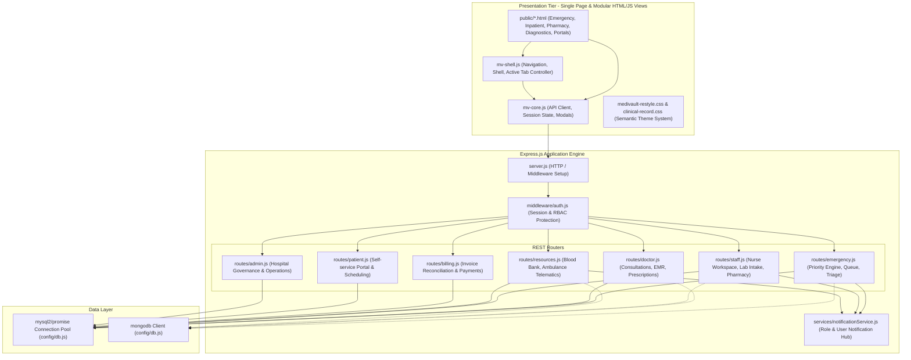

# Component Diagram
## Software Architecture & Module Boundaries

```mermaid
graph TD
    subgraph ClientLayer [Presentation Tier - Single Page & Modular HTML/JS Views]
        Shell["mv-shell.js (Navigation, Shell, Active Tab Controller)"]
        CoreJS["mv-core.js (API Client, Session State, Modals)"]
        Views["public/*.html (Emergency, Inpatient, Pharmacy, Diagnostics, Portals)"]
        Themes["medivault-restyle.css & clinical-record.css (Semantic Theme System)"]
    end

    subgraph ServiceLayer [Express.js Application Engine]
        Server["server.js (HTTP / Middleware Setup)"]
        AuthModule["middleware/auth.js (Session & RBAC Protection)"]

        subgraph RESTControllers [REST Routers]
            CtrlEmergency["routes/emergency.js (Priority Engine, Queue, Triage)"]
            CtrlDoctor["routes/doctor.js (Consultations, EMR, Prescriptions)"]
            CtrlStaff["routes/staff.js (Nurse Workspace, Lab Intake, Pharmacy)"]
            CtrlResources["routes/resources.js (Blood Bank, Ambulance Telematics)"]
            CtrlBilling["routes/billing.js (Invoice Reconciliation & Payments)"]
            CtrlPatient["routes/patient.js (Self-service Portal & Scheduling)"]
            CtrlAdmin["routes/admin.js (Hospital Governance & Operations)"]
        end

        NotifService["services/notificationService.js (Role & User Notification Hub)"]
    end

    subgraph PersistenceLayer [Data Layer]
        MySQLDriver["mysql2/promise Connection Pool (config/db.js)"]
        MongoDriver["mongodb Client (config/db.js)"]
    end

    Views --> Shell
    Views --> CoreJS
    Shell --> CoreJS
    CoreJS --> Server

    Server --> AuthModule
    AuthModule --> CtrlEmergency
    AuthModule --> CtrlDoctor
    AuthModule --> CtrlStaff
    AuthModule --> CtrlResources
    AuthModule --> CtrlBilling
    AuthModule --> CtrlPatient
    AuthModule --> CtrlAdmin

    CtrlEmergency --> NotifService
    CtrlStaff --> NotifService
    CtrlResources --> NotifService

    CtrlEmergency --> MySQLDriver
    CtrlDoctor --> MySQLDriver
    CtrlStaff --> MySQLDriver
    CtrlResources --> MySQLDriver
    CtrlBilling --> MySQLDriver
    CtrlPatient --> MySQLDriver
    CtrlAdmin --> MySQLDriver

    CtrlEmergency -.-> MongoDriver
    CtrlDoctor -.-> MongoDriver
    CtrlStaff -.-> MongoDriver
    CtrlResources -.-> MongoDriver
```
