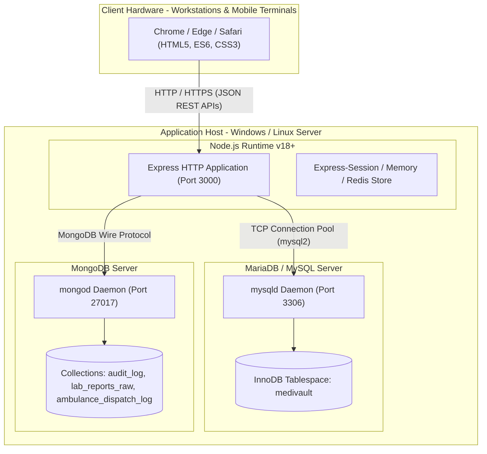

# Deployment Diagram
## Physical Infrastructure & Runtime Topology

```mermaid
graph TD
    subgraph ClientDevice [Client Hardware - Workstations & Mobile Terminals]
        Browser["Chrome / Edge / Safari (HTML5, ES6, CSS3)"]
    end

    subgraph AppHost [Application Host - Windows / Linux Server]
        subgraph NodeRuntime [Node.js Runtime v18+]
            AppInstance["Express HTTP Application (Port 3000)"]
            SessionStore["Express-Session / Memory / Redis Store"]
        end

        subgraph RelationalDB [MariaDB / MySQL Server]
            SQLInstance["mysqld Daemon (Port 3306)"]
            DatabaseFiles[("InnoDB Tablespace: medivault")]
        end

        subgraph DocumentDB [MongoDB Server]
            MongoInstance["mongod Daemon (Port 27017)"]
            MongoCollections[("Collections: audit_log, lab_reports_raw, ambulance_dispatch_log")]
        end
    end

    Browser -- "HTTP / HTTPS (JSON REST APIs)" --> AppInstance
    AppInstance -- "TCP Connection Pool (mysql2)" --> SQLInstance
    SQLInstance --> DatabaseFiles

    AppInstance -- "MongoDB Wire Protocol" --> MongoInstance
    MongoInstance --> MongoCollections
```
