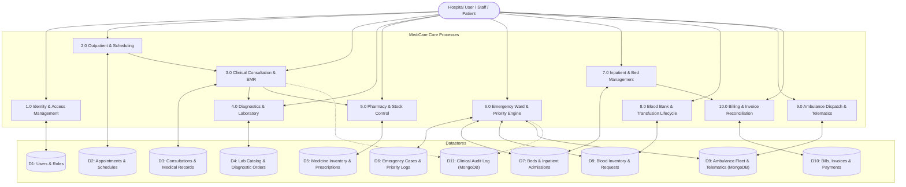

# Data Flow Diagram (DFD) – Level 1
## Functional Subsystems

```mermaid
graph TD
    User(["Hospital User / Staff / Patient"])

    subgraph Processes [MediCare Core Processes]
        P1["1.0 Identity & Access Management"]
        P2["2.0 Outpatient & Scheduling"]
        P3["3.0 Clinical Consultation & EMR"]
        P4["4.0 Diagnostics & Laboratory"]
        P5["5.0 Pharmacy & Stock Control"]
        P6["6.0 Emergency Ward & Priority Engine"]
        P7["7.0 Inpatient & Bed Management"]
        P8["8.0 Blood Bank & Transfusion Lifecycle"]
        P9["9.0 Ambulance Dispatch & Telematics"]
        P10["10.0 Billing & Invoice Reconciliation"]
    end

    subgraph DataStores [Datastores]
        D1[("D1: Users & Roles")]
        D2[("D2: Appointments & Schedules")]
        D3[("D3: Consultations & Medical Records")]
        D4[("D4: Lab Catalog & Diagnostic Orders")]
        D5[("D5: Medicine Inventory & Prescriptions")]
        D6[("D6: Emergency Cases & Priority Logs")]
        D7[("D7: Beds & Inpatient Admissions")]
        D8[("D8: Blood Inventory & Requests")]
        D9[("D9: Ambulance Fleet & Telematics (MongoDB)")]
        D10[("D10: Bills, Invoices & Payments")]
        D11[("D11: Clinical Audit Log (MongoDB)")]
    end

    User --> P1
    P1 <--> D1

    User --> P2
    P2 <--> D2
    P2 --> P3

    User --> P3
    P3 <--> D3
    P3 --> P4
    P3 --> P5
    P3 -.-> D11

    User --> P4
    P4 <--> D4

    User --> P5
    P5 <--> D5

    User --> P6
    P6 <--> D6
    P6 <--> D7
    P6 <--> D8
    P6 <--> D9
    P6 -.-> D11

    User --> P7
    P7 <--> D7
    P7 --> P10

    User --> P8
    P8 <--> D8

    User --> P9
    P9 <--> D9

    User --> P10
    P10 <--> D10
```
