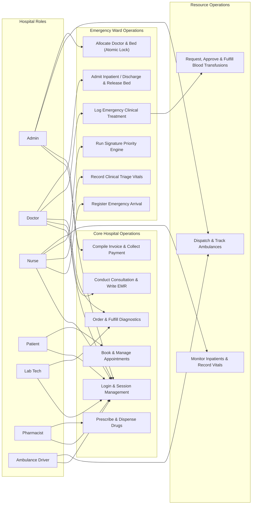

# Use Case Diagram
## MediCare User Roles and Functional Scenarios

```mermaid
graph LR
    subgraph Actors [Hospital Roles]
        A_Admin["Admin"]
        A_Doctor["Doctor"]
        A_Nurse["Nurse"]
        A_Patient["Patient"]
        A_Tech["Lab Tech"]
        A_Pharm["Pharmacist"]
        A_Driver["Ambulance Driver"]
    end

    subgraph CoreUseCases [Core Hospital Operations]
        UC_Auth["Login & Session Management"]
        UC_Appt["Book & Manage Appointments"]
        UC_Consult["Conduct Consultation & Write EMR"]
        UC_LabOrder["Order & Fulfill Diagnostics"]
        UC_Dispense["Prescribe & Dispense Drugs"]
        UC_Bill["Compile Invoice & Collect Payment"]
    end

    subgraph EmergencyUseCases [Emergency Ward Operations]
        UC_EmgReg["Register Emergency Arrival"]
        UC_Triage["Record Clinical Triage Vitals"]
        UC_Engine["Run Signature Priority Engine"]
        UC_Alloc["Allocate Doctor & Bed (Atomic Lock)"]
        UC_EmgTreat["Log Emergency Clinical Treatment"]
        UC_AdmitDischarge["Admit Inpatient / Discharge & Release Bed"]
    end

    subgraph ResourceUseCases [Resource Operations]
        UC_Blood["Request, Approve & Fulfill Blood Transfusions"]
        UC_Fleet["Dispatch & Track Ambulances"]
        UC_NurseRoster["Monitor Inpatients & Record Vitals"]
    end

    A_Admin --> UC_Auth
    A_Admin --> UC_Bill
    A_Admin --> UC_Fleet
    A_Admin --> UC_Alloc

    A_Patient --> UC_Auth
    A_Patient --> UC_Appt

    A_Doctor --> UC_Auth
    A_Doctor --> UC_Consult
    A_Doctor --> UC_LabOrder
    A_Doctor --> UC_EmgTreat
    A_Doctor --> UC_AdmitDischarge

    A_Nurse --> UC_Auth
    A_Nurse --> UC_EmgReg
    A_Nurse --> UC_Triage
    A_Nurse --> UC_Engine
    A_Nurse --> UC_NurseRoster

    A_Tech --> UC_Auth
    A_Tech --> UC_LabOrder

    A_Pharm --> UC_Auth
    A_Pharm --> UC_Dispense

    A_Driver --> UC_Auth
    A_Driver --> UC_Fleet

    UC_EmgTreat --> UC_Blood
```
